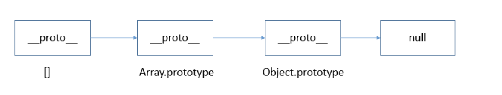

### Types

---

#### 1.1 基本类型: 你可以直接获取到基本类型的值

- `string`
- `number`
- `boolean`
- `null`
- `undefined`
- `symbol`

```js
const foo = 1
let bar = foo

bar = 9

console.log(foo, bar) // => 1,9
```

#### 1.2 复杂类型: 复杂类型赋值是获取到他的引用的值。 相当于传引用

- `object`
- `array`
- `function`

```js
const foo = [1, 2]
const bar = foo

bar[0] = 9

console.log(foo[0], bar[0]) // => 9, 9
```

#### 1.3 javascript 判断数据类型方法

- typeof

```js
typeof '' // => string
typeof 1 // => number
typeof true // => boolean
typeof Symbol() // => symbol
typeof undefined // => undefined
typeof null // => object
typeof new Function() // => function
typeof new Date() // => object
typeof [] // => object
typeof new RegExp() // => object
typeof new Error() // => object
typeof document // => object
typeof window // => object
```

引用类型，除了 function 返回 function 类型外，其他都返回 object。但引用类型中的数组、日期、正则都有属于自己的具体类型，而 typeof 对于这些类型的处理，只返回了处于其原型链最顶端的 Object 类型。

- toString

```js
Object.prototype.toString.call('') // =>[object String]
Object.prototype.toString.call(1) // => [object Number]
Object.prototype.toString.call(true) // => [object Boolean]
Object.prototype.toString.call(Symbol()) // =>[object Symbol]
Object.prototype.toString.call(undefined) // => [object Undefined]
Object.prototype.toString.call(null) // => [object Null]
Object.prototype.toString.call(new Function()) // => [object Function]
Object.prototype.toString.call(new Date()) // => [object Date]
Object.prototype.toString.call([]) // => [object Array]
Object.prototype.toString.call(new RegExp()) // => [object RegExp]
Object.prototype.toString.call(new Error()) // => [object Error]
Object.prototype.toString.call(document) // => [object HTMLDocument]
Object.prototype.toString.call(window) // =>[object global] window 是全局对象 global 的引用
```

toString() 是 Object 的原型方法，调用该方法，默认返回当前对象的 [[Class]] 。这是一个内部属性，其格式为 [object Xxx] ，其中 Xxx 就是对象的类型。

对于 Object 对象，直接调用 toString() 就能返回 [object Object] 。而对于其他对象，则需要通过 call / apply 来调用才能返回正确的类型信息。

- constructor

```js
''.constructor == String // => true
new Number(1).constructor == Number // => true
true.constructor == Boolean // => true
new Function().constructor == Function // => true
new Date().constructor == Date // => true
new Error().constructor == Error // => true
[].constructor == Array // => true
document.constructor == HTMLDocument // => true
window.constructor == Window // => true
```

constructor 是原型 prototype 的一个属性，当函数被定义时候，js 引擎会为函数添加原型 prototype，并且这个 prototype 中 constructor 属性指向函数引用， 因此重写 prototype 会丢失原来的 constructor。
缺点：

1. null 和 undefined 无 constructor，这种方法判断不了

2. 还有，如果自定义对象，开发者重写 prototype 之后，原有的 constructor 会丢失，因此，为了规范开发，在重写对象原型时一般都需要重新给 constructor 赋值，以保证对象实例的类型不被篡改

- instanceof

  instanceof 是用来判断 A 是否为 B 的实例，表达式为：A instanceof B，如果 A 是 B 的实例，则返回 true,否则返回 false。 在这里需要特别注意的是：instanceof 检测的是原型


由上图可以看出[]的原型指向 Array.prototype，间接指向 Object.prototype, 因此 [] instanceof Array 返回 true， [] instanceof Object 也返回 true。

instanceof 只能用来判断两个对象是否属于实例关系， 而不能判断一个对象实例具体属于哪种类型
